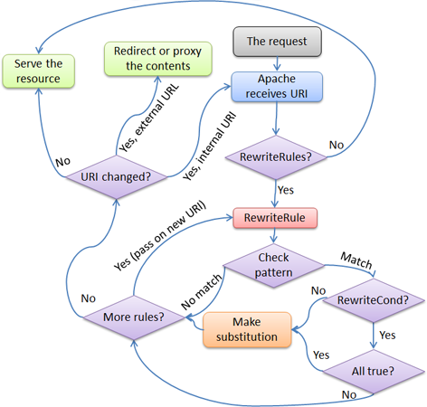

# Apache Notes

La versione lamp contiene il file di configurazione in ``/etc/apache2/apache2.conf``

Il file contiene le principali informazioni di configurazione, ad esempio:

```plaintext
ServerRoot "/etc/apache2"
LogLevel warn
```

ed include altri file di configurazione, del tipo:

```plaintext
# Include all the user configurations:
Include /etc/apache2/httpd.conf

# Include ports listing
Include /etc/apache2/ports.conf
```

## Host virtuali

Ogni sito può essere configurato in un proprio host o host virtuale. Gli host virtuali sono molto utili quando si desidera servire piu host, ognuno con la propria configurazione, dalla stessa macchina.

E possibile aggiungere nomi di host alla macchina semplicemente modificando il file ``/etc/hosts``, mappando sull'interfaccia di loopback i nomi degli host:

```plaintext
127.0.0.1    localhost www.pitt.net pitt.net
```

E' possibile verificare che ciò funzioni con:

```plaintext
ping www.pitt.net
```

E' necessario che apache sia settato in modo che risponda ai nomi degli host, non agli ip, quindi il file ``/etc/apache2/ports.conf`` dovrà contenere la direttiva ``NameVirtualHost *:80``

Il file ``/etc/apache2/httpd.conf`` dovrà avere un nome da associare al server: ``ServerName localhost``

Se questo file non esiste, crearlo ed importarlo da ``/etc/apache2/apache2.conf``

```plaintext
# Include all the user configurations:
Include /etc/apache2/httpd.conf
```

Se non si configura il serverName si avrà l'errore: Could not reliably determine the server's fully qualified domain name, using 127.0.1.1 for ServerName.

Ogni host viene visto come un sito a sè e può avere un proprio file di configurazione nella cartella ``/etc/apache2/sites-available/``

Se è necessario creare una configurazione per un nuovo sito, ciò è facilmente realizzabile creando una copia del file default nella stessa cartella e poi dargli un nome diverso, ad esempio ``/etc/apache2/sites-available/pitt``.

Ogni host ha la configurazione:

```plaintext
<VirtualHost *:80>
    ServerAdmin webmaster@localhost
    ServerName www.pitt.net
    ServerAlias pitt.net

    DocumentRoot /var/www/pitt
    LogLevel debug

    ErrorLog /var/log/apache2/pitt.log
    CustomLog /var/log/apache2/access.log combined
    ...
</VirtualHost>
```

A questo punto bisogna abilitare il virtual host creato (semplicemente aggiungendo un link simbolico nella cartella ``/etc/apache2/sites-enabled/`` oppure utilizzare i comodi comando di abilitazione e disabilitazione del sito (che creeranno i link per noi):

```bash
a2ensite  pitt
a2dissite pitt
```

E riavviare apache:

```bash
/etc/init.d/apache2 restart
```

Infine per verificare che sia raggiungibile da browser, è necessario impostare il proxy in modo che non tenti di usare i DNS per risolvere l'indirizzo, quindi è necessario impostare il SO perché aggiunga il sito www.pitt.net tra gli host ignorati.

Quindi lanciamo il browser e con un bel www.pitt.net visualizzeremo il primo host.

Per testare la sintassi del file di configurazione ``httpd.conf``:

```bash
httpd -tl
```

## Certificati HTTPS su XAMPP

XAMPP ha gia configurati i certificati SSL, per cui abilitare https è estremamente semplice.

Di seguito si illustrano i passi per abilitarlo in una configurazione con virtual host.

Aprire ``XAMPP_HOME/apache/conf/extra/httpd-vhosts.conf``

Cambiare la porta 80 sostituendola con la 443, come nell'esempio successivo:

```plaintext
<VirtualHost *:80>
```

il cui risultato si può vedere qua:

```plaintext
<VirtualHost *:443>
```

Aggiungere nel tag ``<VirtualHost>`` le istruzioni:

```plaintext
SSLEngine on
SSLCertificateFile conf/ssl.crt/server.crt
SSLCertificateKeyFile conf/ssl.key/server.key
```

Riavviare apache

Se si desidera sia avere HTTP che HTTPS, allora si deve duplicare il virtual-host:

```plaintext
<VirtualHost *:80>
    ... 
</VirtualHost>
<VirtualHost *:443>
    ... 
</VirtualHost>
```

## Logging

Per aumentare le informazioni di logging, in ``httpd.conf`` settare ``LogLevel trace8``. Per aumentare le info di logging per uno specifico "componente" (ad esempio il ``mod_rewrite``):

```plaintext
LogLevel warn rewrite:trace8
```

## Url rewriting

Il diagramma seguente spiega come funziona l'url rewriting per apache.


