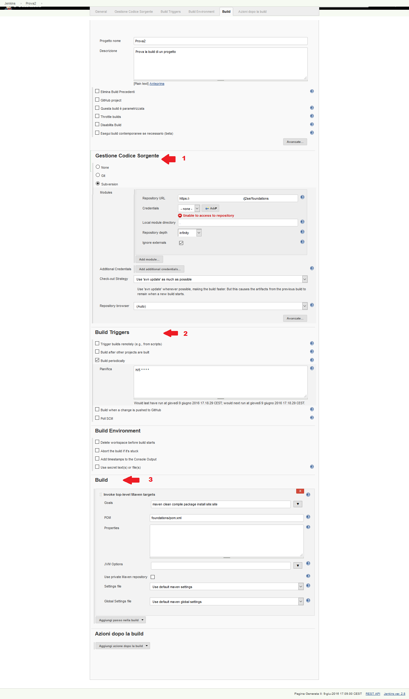
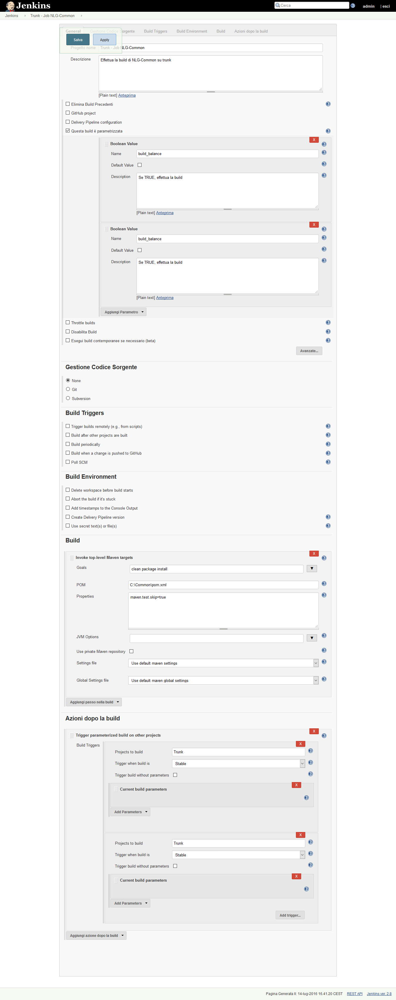
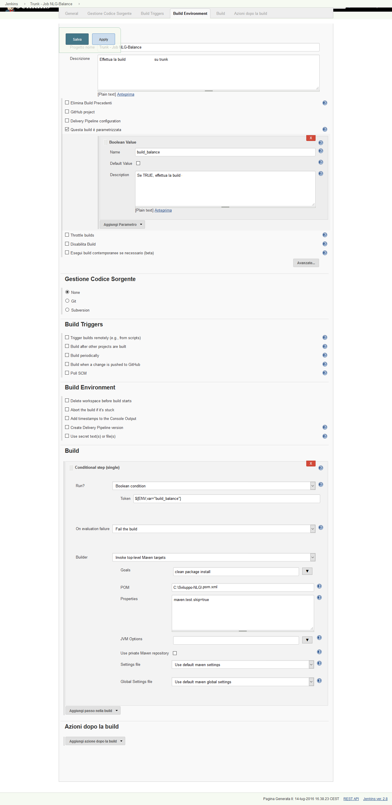
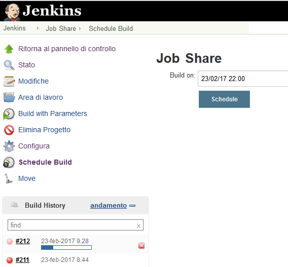

# Jenkins Notes

Jenkins (un fork open source di Hudson, della Oracle) permette di creare JOB (schedulabili o eseguibili a mano) per eseguire compiti (definiti con maven, MicroSoft Build, Ant, ...)

Il programma si avvia semplicemente con ``java -jar jenkins.war`` ma sono anche utili le proprietà ``-Dhudson.model.ParametersAction.keepUndefinedParameters=true`` e ``-Djavax.net.debug=ssl,handshake,failure``

La creazione del JOB è visualizzata nell'immagine seguente:

In questa immagine è possibile visualizzare:

1. La gestione del sorgente tramite git o svn (vedi punto 1 nell'immagine);
2. La ripetizione automatica del job (vedi punto 2 nell'immagine)
3. Il comando da lanciare (vedi punto 3 nell'immagine), in questo caso un comando maven specificando il file ``pom.xml``, il target ``clean compile ...`` ed eventuali proprietà come ``maven.test.skip=true``.

I plugin utili sono:

- Delivery Pipeline View : per vedere la pipeline (grafo di job che innescano altri job).
- Show Build Parameters Plugin : per vedere i parametri di ogni job.
- Parameterized Trigger Plugin : per permettere ad un job di avviare altri job passandogli i propri parametri.
- Schedule Build Plugin : permette di schedulare un job ad una determinata data/ora.
- MSBuild Plugin: permette di compilare progetti c#, VB.Net, ecc..

Per un esempio di job parametrico che avvia altri job passandogli i propri parametri, vedere l'immagine seguente:

Per un esempio di job condizionale, che effettua la build in base a determinate condizioni, vedere l'immagine seguente:

Per avviare un job schedulato vedere l'immagine seguente:

Come si può notare, è possibile scegliere il job, cliccare sul pulsante Schedule Build (Notare che nella vista delle pipeline questo pulsante non è visibile) e scegliere la data/l'ora.

Nota, se si usa svn o git, i file saranno scaricati sotto la cartella ``${USER_HOME}/.jenkins/workspace/${NOME_JOB}`` e quindi il file pom può essere relativo a questa cartella, come nella prima immagine relativa ai job.
