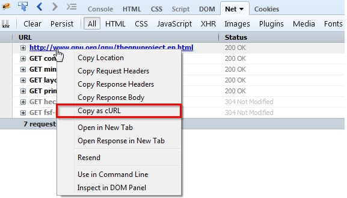

# Curl Notes

Check HTTP Header and Response of HTML pages with curl:

```plaintext
curl -v --request POST --data "form[user]=me" http://site.org/app_dev.php/it/users/me.html
```

Check HTTP Header and Response of JSON pages with curl:

```plaintext
curl -v --request GET --header "Accept: application/json" http://site.org/app_dev.php/it/users/me.json?userGet=me
curl -v --request GET --data "userGet=me" --header "Accept: application/json" http://site.org/app_dev.php/it/users/me.json
curl -v --request POST --data "userPost=me" --header "Accept: application/json" http://site.org/app_dev.php/it/users/me.json
curl -v --request PUT --data "userPut=me" --header "Accept: application/json" http://site.org/app_dev.php/it/users/me.json
curl -v --request PUT --data "form[userPut]=me" --header "Accept: application/json" http://site.org/app_dev.php/it/users/me.json
curl -v --request DELETE --header "Accept: application/json" http://site.org/app_dev.php/it/users/me.json?userDelete=me
```

Check http login (always remember -H Cookie: PHPSESSID=XXX and -H "Connection: keep-alive"):

```plaintext
curl -v -c cookie.txt -H "Cookie: PHPSESSID=1234567890" -H "Connection: keep-alive" "http://site.org/app_dev.php/it/login" --request POST --data "_username=me&_password=me"
curl -v -b cookie.txt -H "Connection: keep-alive" "http://site.org/app_dev.php/it/admin/Superman"
```

Note: HTTP keep-alive, also called HTTP persistent connection or HTTP connection reuse, is the idea of using a single TCP connection to send and receive multiple HTTP requests/responses, as opposed to opening a new connection for every single request/response pair.

Da inspector nativo di Firefox:

- Aprire l'inspector, selezionare il link dal menu Rete in fondo alla pagina;
- Nella parte superiore della pagina tasto destro sull'URL interessato;
- Nel menu scegliere "Copia con curl"


